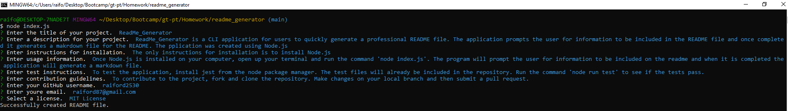

# ReadMe_Generator        

## Description  
ReadMe Generator is a CLI  application for users that need to quickly create a professional README so that they can primarily focus on development. This application allows users to input information they want included on the README including title, description, installation instructions, usage information, test instructions, contribution guidelines, license, and question section for the user's github profile and email. Once the user inputs their information the application then generates a markdown file. The application was developed using Node.js

## Table of Contents  
[Usage](#Usage)  
[Questions](#Questions)  
[License](#License)  

## Usage  
To use the ReadMe_Generator, install Node.js on your computer. Run the command 'node index.js'. Provide answers to the prompts and once completed a markdown file will be generated.

## Questions 
Visit my [GitHub Profile](https://www.github.com/raiford2530)  
For additional questions, contact me by email at raiford87@gmail.com.  

## License  
This project is licensed under MIT License

